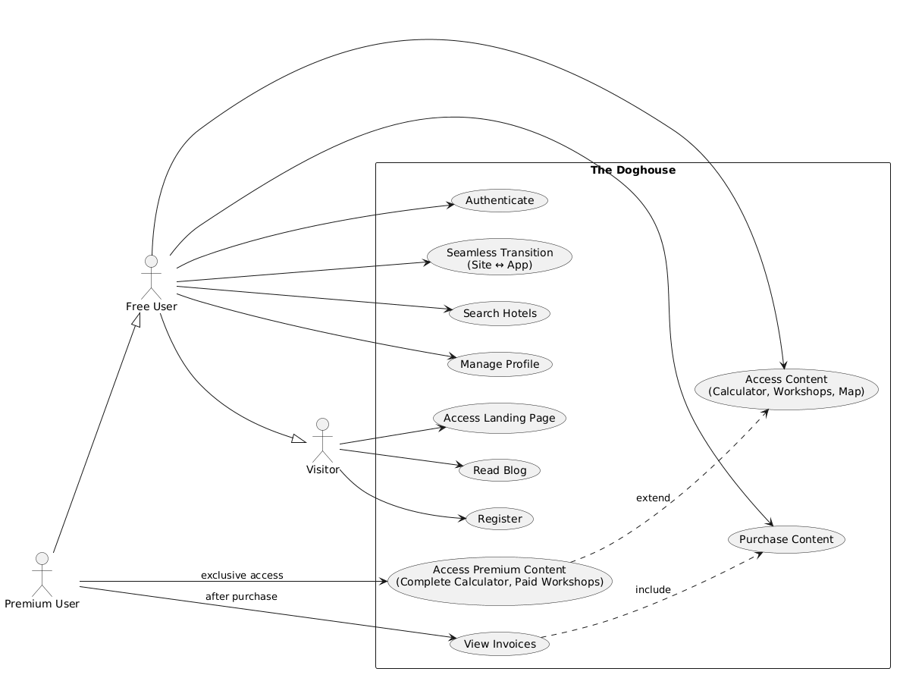

# User Personas and Flows – _The Doghouse_

## 1. Introduction

This document aims to identify and characterize the different user personas that interact with the _The Doghouse_ system, as well as to describe the usage flows that these personas follow throughout their experience on the platform. This analysis is fundamental to guide the subsequent phases of the project, namely requirements specification, database modeling, and the definition of the _API_ (_Application Programming Interface_) endpoints.

The clear identification of personas allows us to understand the needs, objectives, and constraints of each type of user, while the flows describe, in a sequential manner, the concrete interactions that occur between the user and the system. These flows serve as a basis for validating the proposed architecture and for prioritizing the features to be developed within the scope of the _MVP_.

## 2. User Personas

The _The Doghouse_ system comprises three user personas, defined based on access level and purchase history. There is no administrator profile within the scope of the _MVP_, since content management is performed directly in the database or through files.

### 2.1. Visitor

The Visitor is the user who accesses the institutional website without having registered or authenticated. Their main objectives are to learn about the project, read _blog_ articles, and decide whether to register to access the restricted area. Their primary need is a clear presentation of the project's value and a simple, fast registration process. Their access level is restricted to the _landing page_ and the _blog_, with no access to any functionality of the _Flutter_ application. The _blog_ is accessible to all visitors without authentication, promoting _SEO_ and attracting organic traffic.

### 2.2. Free User

The Free User has completed registration and authentication, either via _magic link_ or social login, but has not yet made any purchase of premium content. This user intends to explore the platform's free features, namely the basic calculator, free _workshops_, and the full map. Their primary need is to understand the value of premium content and feel confident to make an individual purchase. Their access level includes the basic version of the calculator, free _workshops_, and the map without any limitation on radius or number of results.

### 2.3. Premium User

The Premium User differs from the previous one by having made one or more individual purchases of premium content. It is important to note that access is granted exclusively to the content the user has purchased; there is no universal full access. This user intends to enjoy the premium content they have acquired, such as the complete calculator, paid _workshops_ or _bundles_, and eventually purchase more content in the future. Their need is to manage their purchase portfolio and have a transparent experience regarding what they have access to and what they can still purchase. Their access level is lifetime for the content they have purchased, while unpurchased content remains locked, with a clear indication that it can be acquired.

## 3. Usage Flows

The flows described in this section represent the main user journeys within the system, from the first contact to the completion of a specific task.

### 3.1. Registration and Authentication

This flow describes how a visitor becomes a free user.

The visitor accesses the _landing page_ and clicks on Member Area or Register. The system presents two options: registration by email with a _magic link_ or registration by social login through _Google_ or _Facebook_.

In the _magic link_ option, the user enters their email, the system sends a magic link to the provided email, and the user clicks the link to be automatically authenticated. In the social login option, the user clicks the _Google_ or _Facebook_ button, the system redirects to the social provider where the user authorizes access, and the system receives the return and authenticates the user. After authentication, the user is redirected to the _Flutter_ application with an active session and is considered a Free User.

### 3.2. Seamless Navigation Between Website and Application

This flow describes the continuous transition between the institutional website in _HTML_, _CSS_, and _JavaScript_ and the _Flutter_ application, without the user having to repeat the login.

The free or premium user is authenticated and browsing the _blog_ of the institutional website. In the article, there is a button like Try this tool in the App or Access your restricted area. When clicking this button, the website redirects to the _Flutter_ application subdomain. The application reads the shared _cookie_ or authentication _token_, configured for the same base domain, and recognizes the active session. The user is then presented with their restricted area in the _Flutter_ application without having to enter credentials again.

### 3.3. Access to Free Content

This flow describes how a free user explores the available features without making any payment.

The free user accesses the _Flutter_ application and navigates through the three areas. In the calculator, they select the breed and age, and the system returns an approximate ideal weight, which corresponds to the basic version. In the _workshops_ area, they view the list of breeds, and each breed has a free introductory video they can watch. On the map, the system displays _pet-friendly_ hotels with all results available, since the map is universal and does not differentiate between free and premium versions. Paid content, such as the complete calculator and paid _workshops_, is visible but locked, with a clear _Premium_ indication and a button to purchase.

### 3.4. Purchase of Premium Content

#### 3.4a. Purchase Initiation

This sub-flow describes the beginning of the purchase process, from the user's click to the payment confirmation on _Stripe_.

The free user is in the _Flutter_ application and tries to access locked content, such as the complete calculator or a paid _workshop_. The system displays a message indicating that the content is premium and that the user can purchase it for a certain amount, with a Buy now button. When clicking this button, the system creates a _checkout_ session on _Stripe_, in a _sandbox_ environment, and redirects the user to the _Stripe_ payment page. The user enters payment data, using test cards provided by _Stripe_, and confirms the purchase.

#### 3.4b. Webhook Processing and Unlocking

This sub-flow describes the purchase processing after payment is made, up to the content unlocking.

_Stripe_ processes the payment and sends a _webhook_ to the _backend_ in _Go_. The _backend_ validates the _webhook_, records the purchase in the database, associating the user with the acquired content, and records the purchase date for invoicing purposes. Simultaneously, the _backend_ calls the _Moloni_ _API_, also in a _sandbox_ environment, to generate a simulated invoice. _Moloni_ generates a _PDF_ document in invoice format, including the project logo, date, amount, and purchase data, allowing the invoicing flow to be demonstrated. This invoice is only simulated and has no legal value or tax effects. The _backend_ stores the invoice reference in the database, associating it with the user and the purchase.

The _Flutter_ application, which may be _polling_ the _backend_ or receiving a notification, detects that the content is now unlocked for that user. The user returns to the application and the content is accessible, with lifetime access.

This purchase flow applies to all purchase levels available in the _workshops_ area. The user can buy an individual video, a _bundle_ per breed, a complete _bundle_ with all videos existing at the time of purchase, or a lifetime _bundle_ that includes all present and future videos. Each of these options has a specific price and grants the user the corresponding access.

### 3.5. Using the Calculator

This flow describes the difference between the free and premium versions of the calculator.

In the free version, the user selects the dog's breed from a predefined list and enters the age. The system returns an approximate ideal weight value, such as "The ideal weight for a [breed] with [age] is approximately X kg." The user also sees a message indicating that to obtain the complete table with percentiles and recommendations, they should purchase the Premium version.

In the premium version, the user who has already purchased the calculator accesses the tool, selects the breed and age, and the system returns a complete table with percentiles, growth curves, and personalized dietary recommendations. The user can also save the results for future reference, although this feature is optional.

### 3.6. Using the Workshops

This flow describes the difference between free and paid _workshops_, as well as the different purchase levels.

The user accesses the _workshops_ area and views a list of breeds. Each breed has a free introductory video, covering general characteristics, temperament, and basic needs. For each breed, there is a set of paid videos on specific care, nutrition, training, and health, which are locked for free users.

The free user can only watch the introductory videos. The premium user who purchased an individual video has access only to that specific video. The user who purchased the breed _bundle_ has access to all videos of that breed. The user who purchased the complete present _bundle_ has access to all videos of all breeds existing at the time of purchase. The user who purchased the lifetime _bundle_ has access to all existing videos and all that will be added in the future. A user who purchased an individual video of a breed can later purchase the _bundle_ for that breed, and the system should adjust access accordingly, without duplicating costs.

### 3.7. Searching for Hotels on the Map

This flow describes the search for _pet-friendly_ hotels on the map. The map is available to all authenticated users, with no distinction between free and premium.

The user accesses the map area and has two ways to initiate the search. If they click the Near Me button, the system obtains the device's coordinates through the _geolocator_ package and centers the map on that location. If they instead type a location in the search bar, such as "Porto", the system uses a free geocoding service (e.g., _Nominatim_) to convert the text into coordinates and center the map on that point.

In both cases, the map's behavior is identical. The _backend_ receives the current _viewport_ boundaries, defined by the north, south, east, and west points, and queries the _cache_ or the _Overpass API_ to obtain _pet-friendly_ hotels, using the tags `dog=yes` or `pets=yes`, whose coordinates are within those boundaries. The _backend_ returns only the hotels visible in the map area, without any fixed radius restriction. Whenever the user moves the map or zooms, the _frontend_ sends the new _viewport_ boundaries and the process repeats, ensuring the map is always updated with results corresponding to the visualized area.

When clicking on a marker, the system displays basic hotel information, such as name, address, and contact, if available, and provides a button to Open in map, which redirects to the device's native maps application.

### 3.8. Viewing Invoices

After a successful purchase, the premium user can view the invoice in their restricted area. The _backend_, when receiving the _Stripe_ _webhook_ and generating the invoice in _Moloni_, stores the public _URL_ of the invoice provided by _Moloni_ in the database, associated with the user and the purchase. The user accesses the My Invoices section and sees the list of issued invoices. When clicking on an invoice, the system makes the _PDF_ available for download or viewing, through the public _URL_. _Moloni_ already handles the _PDF_ customization with the project logo and chosen template, ensuring the final invoice has a cohesive visual identity, even in _sandbox_ mode.

### 3.9. Error Handling Flows

The following flows describe alternative behaviors in failure situations, ensuring system robustness.

#### 3.9a. Authentication Failure (Expired or Invalid Magic Link)

The user requests a _magic link_ but does not use it within the fifteen-minute validity period. When the user clicks the expired link, the system displays an informative message indicating that the link is no longer valid. The system provides a button to request a new link, which redirects the user to the _magic link_ request form with the email pre-filled. If the user tries to use the same link twice, the system detects that the _token_ has already been consumed and displays a similar message, redirecting to the request for a new link.

#### 3.9b. Payment Failure (Card Declined or Timeout)

The user initiates the purchase process and is redirected to the _Stripe_ payment page. If the card is declined or a _timeout_ occurs in the communication, _Stripe_ notifies the user on the payment page itself. The user can try again with another card or payment method. The _backend_ does not receive any success _webhook_, so the content remains locked. The user returns to the _Flutter_ application and the content continues to appear as premium available for purchase. The system does not record any failed attempt unless _Stripe_ sends a failure _webhook_, which can be logged for monitoring purposes.

#### 3.9c. Stripe Webhook Failure

The payment is successfully processed on _Stripe_, but the _webhook_ does not reach the _backend_ or arrives with an error (e.g., _timeout_, validation error). The user, meanwhile, sees the _Stripe_ success page and returns to the _Flutter_ application, but the content is still not unlocked. The system should implement a _retry_ logic for the _webhook_, where _Stripe_ attempts to resend the _webhook_ multiple times (with increasing intervals). While the _webhook_ is not successfully processed, the user may see the content still locked. To mitigate this issue, the _Flutter_ application can _poll_ the _backend_ to check the purchase status, allowing the unlocking to occur even if the _webhook_ is delayed. After the _webhook_ is successfully processed, the _backend_ records the purchase and unlocks the content, making it available on the user's next check.

### 3.10. Time Constants

The following time constants are applied throughout the system and must be reflected in database modeling and _backend_ logic:

- **Magic Link:** 15-minute validity; single use.
- **Data Cache (_Overpass API_):** TTL (_Time To Live_) of 24 hours.
- **User Session:** Maintained while the _JWT_ _token_ is valid. _Token_ duration: 7 days (renewable upon re-authentication).

## 4. Persona to Feature Mapping

The visitor has access only to the _landing page_, the _blog_, and the registration and authentication form.

The free user has access to the basic version of the calculator, free _workshops_ (i.e., the introductory videos for each breed), the full map, and their user profile. They also have the possibility to purchase premium content through the purchase flow and to view invoices after making a purchase.

The premium user, for each content they have purchased, has access to the complete calculator (if purchased), paid _workshops_ (whether individual videos, breed _bundles_, complete present _bundle_, or lifetime _bundle_), and the map, which is universal and does not require purchase. Access is lifetime, and the user can always acquire new content.

## 5. Business Rules

The following rules condition the described flows and must be reflected in database modeling and _backend_ logic:

1. Authentication is done exclusively via _magic link_, with a fifteen-minute validity period and single use, or via social login through _Google_ or _Facebook_. The system does not support traditional email and password login.
2. Purchases are always individual and access is lifetime. There are no subscriptions or recurring payments. Each content item, whether a calculator, a _workshop_, or a _bundle_, is an autonomous item that can be purchased individually.
3. Access is conditional. A premium user only has access to the content they have purchased. There is no global premium status. For example, a user who purchased the calculator does not automatically have access to paid _workshops_.
4. Free content is common to all authenticated users. Everyone has access to the basic calculator, the introductory _workshop_ videos, and the full map.
5. The _magic link_ has a fifteen-minute validity period and can only be used once. After use or expiration, the user must request a new link.
6. Data obtained via the _Overpass API_ is cached on the server, persisted in the database, with a TTL (_Time To Live_) of twenty-four hours. After this period, the data is considered obsolete and a new query to the external source is performed.
7. Geolocation is only obtained after explicit user consent. The user can decline and use only text-based search, such as searching for "Porto".
8. Invoice issuance is done by _Moloni_ in a _sandbox_ environment. _Moloni_ generates a simulated _PDF_ document with the appearance of an invoice, including logo and custom template. Simulated invoices serve only for flow demonstration, without legal value or communication with tax authorities. In the future, migration to production will require a commercial _Moloni_ account. The _backend_ stores the invoice reference in the database for future consultation.
9. The map respects the current _viewport_. The _backend_ returns only hotels whose coordinates are within the limits sent by the _frontend_, ensuring efficiency and scalability. This rule applies to all authenticated users, without distinction between free and premium.

## 6. Conclusion

The identification of personas and flows is a structuring step in the development of the _MVP_ _The Doghouse_. This document clearly defines who the users are, what they want, and how they interact with the system, providing a solid foundation for the subsequent phases of the project.

The distinction between free and premium users was designed to reflect a flexible business model, where the user decides which content to purchase, rather than subscribing to a global plan. This approach, combined with modern authentication through _magic links_ and social login, and the _seamless_ transition between the institutional website and the _Flutter_ application, positions _The Doghouse_ as a technically current project centered on user experience.

The described flows, with special focus on geographic search with dynamic _viewport_ and integration with the _Overpass API_, establish a standard for implementing the map area, ensuring real data, acceptable performance, and scalability. The _workshop_ purchase structure, with four acquisition levels, demonstrates a sophistication that goes beyond the simple subscription model, offering true flexibility to the user.

With this document completed, the project is ready to advance to the technical specification phases, namely database modeling, _API_ endpoint definition, and _UML_ diagram creation.

---

## Annex – Use Case Diagram

_Figure 1 – Use Case Diagram of The Doghouse. The diagram illustrates the actors (Visitor, Free User, Premium User) and the main use cases of the system, including registration, authentication, access to free and premium content, purchase, invoice viewing, hotel search, and seamless navigation._
