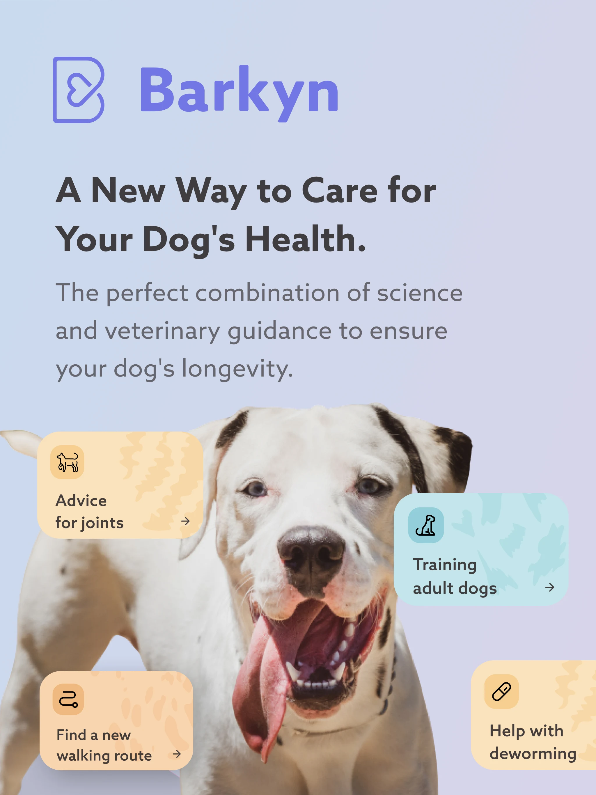
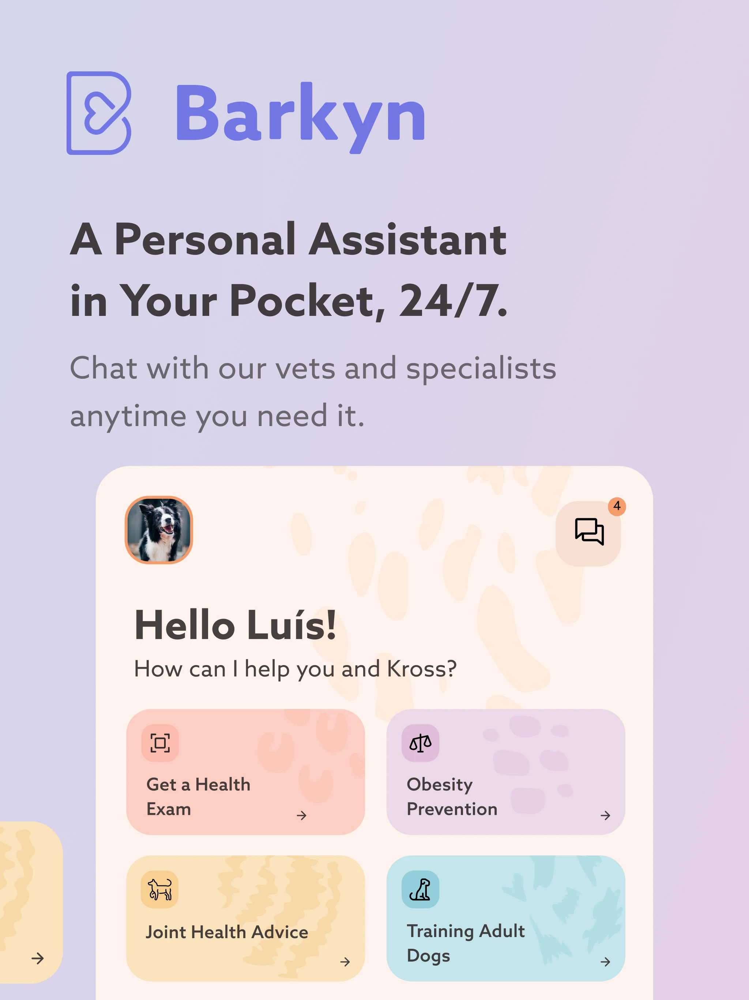
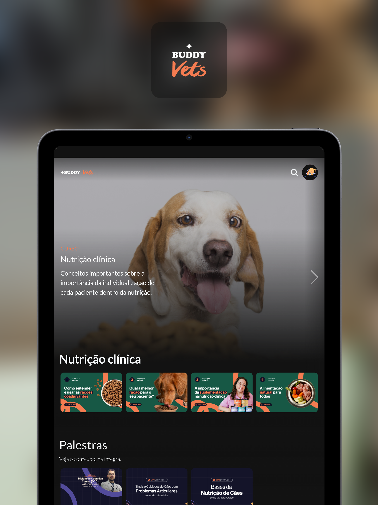
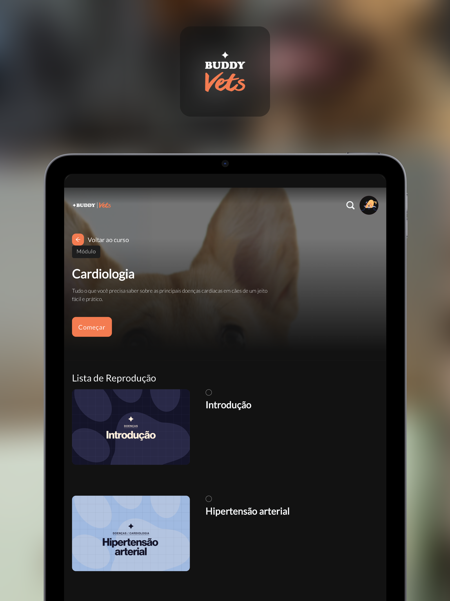
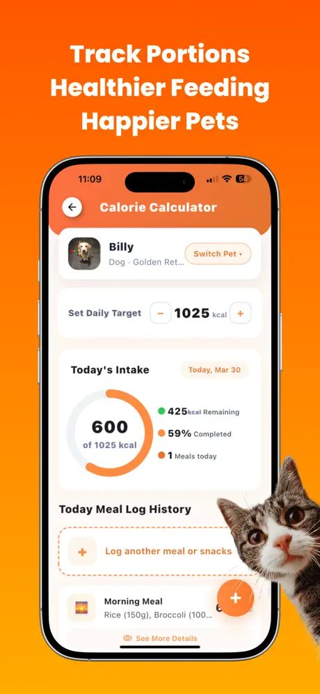
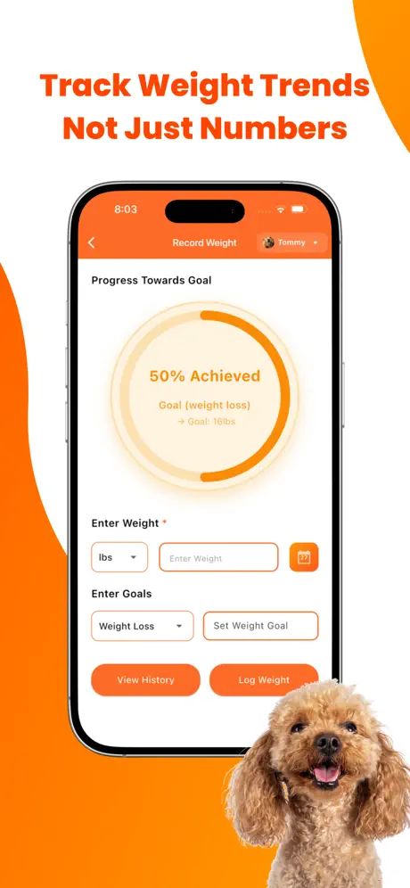
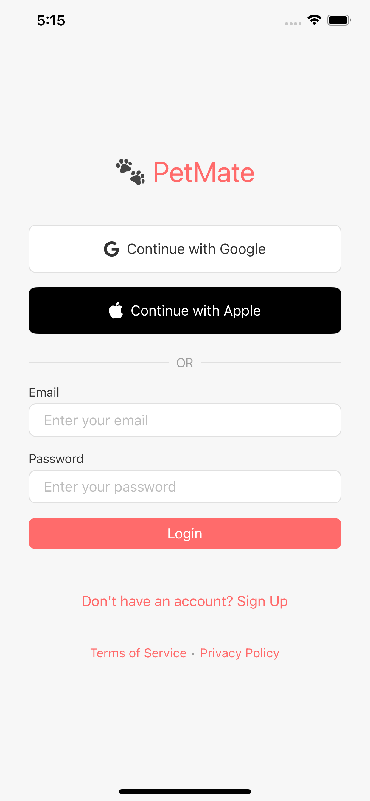

# Research of Similar Applications – _The Doghouse_

## Introduction

This section aims to identify and analyze a set of applications and platforms currently on the market that relate, directly or indirectly, to the _The Doghouse_ system. Researching similar solutions allows for an understanding of the state of the art, recognition of best practices, identification of common limitations, and, above all, extraction of lessons that can inform and improve the development of the prototype.

Five applications with different approaches to the digital ecosystem for dog owners were selected. The selection criteria included relevance to the project's three functional areas – calculator, workshops, and maps – as well as geographic and functional diversity, and the availability of public information. The research includes Portuguese applications (Barkyn) and international applications (FLUTO, BringFido), reflecting a combination of local market and global references.

For the educational structure of the workshops area, Buddy Vets was included as an _indirect reference_ – although it is a professional (B2B) platform, it offers educational video standards and certification models applicable to consumer contexts. For the community component (planned as a future expansion), Pet Mate was included as an _indirect reference_ of how verification and trust systems can be implemented in pet‑tech ecosystems.

For each application, a general description, main functionalities, strengths and weaknesses, and a comparative analysis with _The Doghouse_ are presented, highlighting the lessons that can be applied to the project.

## Individual Analysis of Applications

### Category 1: E‑commerce and Subscription

#### Barkyn

**Link:** https://www.barkyn.com  
**Last verified:** August 14, 2026

**General description:**

Barkyn is a Portuguese startup (headquartered in Porto) that offers a personalized subscription service for dog food and snacks. Founded in 2017, the company has raised €15 million in funding. The platform combines e‑commerce with a monthly subscription model, where the dog owner receives a box with food and accessories adapted to the specific needs of the animal, based on information such as breed, age, weight, and activity level. Barkyn positions itself as a convenience and personalization solution, eliminating the need for owners to visit physical stores and ensuring that the dog always receives the appropriate food. The company has over 150,000 registered dogs, a team of 12 veterinarians, and a 4.6‑star rating from over 6,700 reviews.

**Key relevant features:**

The platform offers a flexible subscription system, where the user can choose delivery frequency and customize the box content based on the dog's profile. The onboarding process collects detailed information about the animal and uses it to suggest the most suitable meal plan. Barkyn also provides an educational resources area with articles and tips on canine nutrition, health care, and well‑being. The platform also includes an account management system with order history, subscription management, and integrated customer support.

**Strengths:**

Barkyn's main strength is its data‑driven personalization model, which creates an experience tailored to each dog. The convenience of monthly subscription is a significant competitive differentiator, eliminating the need for recurring purchases at physical stores. Its presence in the Portuguese market (with a strong social media presence) and product certification reinforce user trust.

**Weaknesses:**

Barkyn is essentially an e‑commerce platform and does not include tools such as interactive weight calculators, video workshops, or georeferenced maps. The focus is on product sales, not education or community.

**Comparison with _The Doghouse_ (suitability and lessons learned):**

Barkyn has moderate suitability to the concept of _The Doghouse_. Personalization based on the dog's profile and subscription management are ideas that can be adapted for the premium content purchase system – for example, workshop bundles based on the dog's breed.

**Lessons for _The Doghouse_:**

| Lesson                                                                              | Priority | Complexity | Implementation       |
| ----------------------------------------------------------------------------------- | -------- | ---------- | -------------------- |
| Explore personalization based on the animal's profile to recommend specific content | High     | Medium     | Phase 3 (Delivery 6) |
| Consider creating a subscription system for ongoing premium content access (future) | Low      | High       | Future               |

**Screenshots:**

<table>
  <tr>
    <td></td>
    <td></td>
  </tr>
</table>

### Category 2: Education and Content

#### Buddy Vets (Indirect Reference)

**Link:** https://play.google.com/store/apps/details?id=com.buddyvets.mobile  
**Last verified:** August 14, 2026

**General description:**

Buddy Vets is a free education platform for Veterinarians, trainers, students, and animal health professionals. Created to simplify technical content such as nutrition and canine health, Buddy Vets offers practical tools, a calorie calculator, booklets, and various materials to improve professional routines. The platform is available for Android and is developed by a Brazilian company.

**Key relevant features:**

The platform offers certified courses with complete video lessons from specialists, covering topics such as veterinary medicine, nutrition, and animal well‑being. It also includes technical booklets, breed guides, a disease library, monthly live sessions, webinars, a community for experience exchange, and a calorie calculator.

**Strengths:**

The educational focus and credibility of the content (produced by specialists) are Buddy Vets' main strengths. The offering of certifications is an important differentiator for industry professionals. The calorie calculator is a practical and useful tool.

**Weaknesses:**

The platform does not include geolocation features or maps with pet‑friendly services. The business model is more focused on education and community than on e‑commerce or location‑based services.

**Comparison with _The Doghouse_ (suitability and lessons learned):**

Buddy Vets is an indirect reference for _The Doghouse_ workshops area, especially regarding educational structure. However, the target audience is professional (veterinarians, trainers), while _The Doghouse_ is B2C (dog owners). The lessons (video courses, certification, community) are applicable, but monetization and tone will differ.

**Lessons for _The Doghouse_:**

| Lesson                                                                                  | Priority | Complexity | Implementation       |
| --------------------------------------------------------------------------------------- | -------- | ---------- | -------------------- |
| Adopt video content structure organized by levels or breeds                             | High     | Medium     | Phase 3 (Delivery 5) |
| Implement interactive calculators based on scientific data (even simplified in the MVP) | High     | Medium     | Phase 3 (Delivery 3) |
| Explore the freemium model with free and paid content                                   | High     | Medium     | Phase 3 (Delivery 6) |

**Screenshots:**

<table>
  <tr>
    <td></td>
    <td></td>
  </tr>
</table>

### Category 3: Maps and Location

#### FLUTO Pet Care Tracker

**Link:** https://apps.apple.com/app/fluto-pet-care-tracker-dog-cat/id6744916647  
**Last verified:** August 14, 2026

**General description:**

FLUTO is a pet care application available exclusively for iPhone. It is a free app with in‑app purchases. FLUTO positions itself as an all‑in‑one pet health & care app for dogs and cats, with features such as AI symptom insights, weight tracking, and daily routines.

**Key relevant features:**

The application includes a veterinary diary (voice recording of visits, prescriptions, and follow‑ups), a travel planner with pets, a calorie calculator, digital health records, a daily routine checklist, an explorer map to discover pet‑friendly places, a community, a weight log with charts, and AI symptom insights.

**Strengths:**

The integration of multiple functionalities into a single application is a significant strength, eliminating the need for multiple different apps. The weight tracking and charting feature aligns directly with _The Doghouse_'s ideal weight calculator. The interactive map with pet‑friendly places is a direct inspiration for the maps area.

**Weaknesses:**

FLUTO does not include a workshops area or video educational content. The focus is on pet data management, not education or community. It is available only for iOS.

**Comparison with _The Doghouse_ (suitability and lessons learned):**

FLUTO has moderate‑to‑high suitability for the concept of _The Doghouse_, especially in the calculator and maps areas. The weight tracking and charting is an inspiration for the premium version of the calculator. The interactive map with pet‑friendly places is an example of how to integrate location data into the application.

**Lessons for _The Doghouse_:**

| Lesson                                                                      | Priority | Complexity | Implementation       |
| --------------------------------------------------------------------------- | -------- | ---------- | -------------------- |
| Implement weight evolution charts for the premium version of the calculator | High     | Medium     | Phase 3 (Delivery 6) |
| Explore location data integration for the maps area                         | High     | Medium     | Phase 3 (Delivery 4) |

**Screenshots:**

<table>
  <tr>
    <td></td>
    <td></td>
  </tr>
</table>

#### Pet Mate (Indirect Reference)

**Link:** https://play.google.com/store/apps/details?id=com.avalontech.petmateapp  
**Last verified:** August 14, 2026

**General description:**

Pet Mate, also known as PetMate, is an all‑in‑one dating and community application for pets. It focuses on pet meetups, finding playmates, adoption, and safe rehoming. It is available for Android and developed by an Indian company.

**Key relevant features:**

The application allows users to find playdates with nearby pets, match for responsible breeding, adopt or rehome animals safely, and chat with other verified owners. It includes owner and pet verification, health verification supported by veterinarians, location‑based matching, and premium plans.

**Strengths:**

The focus on the social and community component is Pet Mate's main strength. Owner and pet verification, along with integration with veterinarians, creates a trust ecosystem.

**Weaknesses:**

The application does not include calculators, educational tools, or pet‑friendly location maps (the focus is on matching between animals). The business model relies on premium plans.

**Comparison with _The Doghouse_ (suitability and lessons learned):**

Pet Mate is an indirect reference for _The Doghouse_. It has low suitability for the MVP, as it is focused on dating and meetups between animals, not calculators, workshops, or maps. However, it has high suitability for future expansions – the community component, profile verification, and matching could inspire a community system for _The Doghouse_.

**Lessons for _The Doghouse_:**

| Lesson                                                                                  | Priority | Complexity | Implementation |
| --------------------------------------------------------------------------------------- | -------- | ---------- | -------------- |
| Consider creating a profile verification system (e.g., for veterinarians) in the future | Low      | High       | Future         |
| Explore the social component (community, sharing) as a future differentiator            | Low      | High       | Future         |

**Screenshots:**

<table>
  <tr>
    <td></td>
    <td></td>
  </tr>
</table>

#### BringFido

**Link:** https://www.bringfido.com  
**Last verified:** August 14, 2026

**General description:**

BringFido is a global platform (with mobile app and website) dedicated exclusively to discovering pet‑friendly hotels, accommodations, and restaurants. With over 500,000 pet‑friendly locations, it is considered the world's leading pet travel brand and the most trusted resource for dog owners looking for hotels, attractions, and restaurants that accept pets. The app is available for iOS and Android and includes a Canine Concierge service that guarantees pet‑friendly rooms.

**Key relevant features:**

The search for pet‑friendly hotels and accommodations is the main feature, with filters by location, price, type of accommodation, and pet policies (maximum weight, number of pets allowed, etc.). Reviews and comments from other users are a valuable source of information. The platform also includes direct booking of accommodations.

**Strengths:**

Specialization in the pet‑friendly niche is the main strength. The database is comprehensive and community reviews create a trust system. Direct booking capability simplifies the process for users. The business model (hotel partnerships and commissions) is sustainable.

**Weaknesses:**

These applications are niche and do not include other functionalities such as calculators or workshops. The focus is exclusively on accommodation search. Information quality may vary by region.

**Comparison with _The Doghouse_ (suitability and lessons learned):**

The suitability of these applications to _The Doghouse_'s maps area is very high. The use of location filters and accommodation policies, as well as the integration of reviews, are directly applicable features.

**Lessons for _The Doghouse_:**

| Lesson                                                                  | Priority | Complexity | Implementation       |
| ----------------------------------------------------------------------- | -------- | ---------- | -------------------- |
| Implement search filters by location, price, and accommodation policies | High     | Medium     | Phase 3 (Delivery 4) |
| Explore integration with user reviews and comments                      | Low      | High       | Future               |

**Screenshots:**

<table>
  <tr>
    <td></td>
  </tr>
</table>

## Recurring Patterns and Consolidated Lessons

The analysis of the five applications reveals three recurring patterns that are particularly relevant to _The Doghouse_.

### Pattern 1: Personalization as a Differentiator

**Apps that do it well:** Barkyn (bases its meal plan on the animal's profile)

**Lesson for _The Doghouse_:** Personalization based on the dog's profile (breed, age, weight) should be a priority. Workshop recommendations and calculator results should be adapted to the user's profile.

### Pattern 2: Maps as an Essential Feature

**Apps that do it well:** BringFido (filters and detailed information), FLUTO (explorer map)

**Lesson for _The Doghouse_:** The maps area should include filters by textual location, category (hotels, parks, veterinarians), and accommodation policies. The search should be flexible and the presentation of detailed information should be a priority.

### Pattern 3: Community and Verification

**Apps that do it well:** Pet Mate (owner and pet verification, trust system)

**Lesson for _The Doghouse_:** Community is not a priority for the MVP, but it is an opportunity for future growth. Creating a profile verification system and a trust system can increase user engagement.

## Comparative Table

_Table 1 – Functional and business model comparison between the analyzed applications and The Doghouse. The symbols used have the following meanings: ✓ feature present; ✗ feature absent; Indirect reference – application that offers applicable lessons (e.g., educational structure, community); IAP – in‑app purchases; — not applicable (reference application)._

| Application        | Platform                    | Calculator           | Workshops                | Maps  | E‑commerce | Community      | Business Model             | Suitability for _The Doghouse_             |
| ------------------ | --------------------------- | -------------------- | ------------------------ | ----- | ---------- | -------------- | -------------------------- | ------------------------------------------ |
| **Barkyn**         | Web, iOS, Android           | ✗                    | ✗ (articles only)        | ✗     | ✓          | ✗              | Subscription + E‑commerce  | Moderate (personalization)                 |
| **Buddy Vets**     | Android                     | ✓ (calories)         | ✓ (professional courses) | ✗     | ✗          | ✓              | Freemium + Certifications  | Indirect reference (educational structure) |
| **FLUTO**          | iOS                         | ✓ (weight, calories) | ✗                        | ✓     | ✗          | ✓              | Free (with IAP)            | Moderate‑High (calculator + map)           |
| **Pet Mate**       | Android                     | ✗                    | ✗                        | ✗     | ✗          | ✓              | Premium (paid plans)       | Indirect reference (community)             |
| **BringFido**      | Web, iOS, Android           | ✗                    | ✗                        | ✓     | ✓          | ✓              | Partnerships + Commissions | High (maps and filters)                    |
| **_The Doghouse_** | **Web (PWA), iOS, Android** | **✓**                | **✓**                    | **✓** | **✓**      | **✗ (future)** | **Freemium + E‑commerce**  | **—**                                      |

## Conclusion

The analysis of the five similar applications – Barkyn, Buddy Vets, FLUTO, Pet Mate, and BringFido – allowed the extraction of a set of fundamental lessons for the development of _The Doghouse_, organized into three main axes corresponding to the project's functional areas.

### Ideal Weight Calculator

Applications that include calculators, such as Buddy Vets and FLUTO, demonstrate the importance of a simple and intuitive interface, with data presented clearly and visually (charts, percentiles). Personalization based on the animal's profile is a valued feature by users. For _The Doghouse_, the lesson is to implement a functional and objective calculator, with a free version (approximate value) and a premium version (complete table, percentiles, recommendations).

### Workshops Area (Education and Content)

Buddy Vets is the indirect reference in this area, with a structured offering of video courses organized by levels and with certification. Although Buddy Vets' target audience is professional (veterinarians and trainers), the educational structure is applicable to _The Doghouse_'s B2C context. For the MVP, the focus will be on providing free introductory videos and paid workshops, with a purchase structure by individual video, breed bundle, complete present bundle, and lifetime bundle.

### Maps Area with Geolocation

BringFido is the specialized reference in the maps area, with filters by location, price, and accommodation policies. FLUTO includes a map, but it is not the application's main focus. For _The Doghouse_, the lesson is to implement a functional map with search by location (textual and geolocation), filters by category (hotels, parks, etc.), and presentation of detailed information about each location (name, address, contact, reviews). Dynamic viewport (loading only the data visible on the map) is a practice to adopt for performance optimization.

### What _The Doghouse_ Does Differently

While the analyzed applications focus predominantly on a single functional area or a specific service, _The Doghouse_ proposes a complete ecosystem with three integrated functional areas: calculator, workshops, and maps. This integration in a single location is an important differentiator, offering the user a unified and convenient experience.

Furthermore, _The Doghouse_ adopts a flexible business model where the user decides which content to purchase (one‑time purchase), instead of a mandatory subscription (present in Barkyn). This approach, combined with modern authentication (magic links and social login) and seamless transition between the institutional website and the Flutter application, positions _The Doghouse_ as a technically current and user‑centered solution.

In summary, the research of similar applications reveals a fragmented market, where each solution dominates a specific niche (e‑commerce, professional education, social, or maps). _The Doghouse_ differentiates itself by integrating these three areas into a single B2C ecosystem, offering convenience and flexibility that specialized solutions cannot provide. This integrated approach, combined with a flexible business model and a modern architecture, positions the project as a coherent and competitive alternative in the pet‑tech market.
