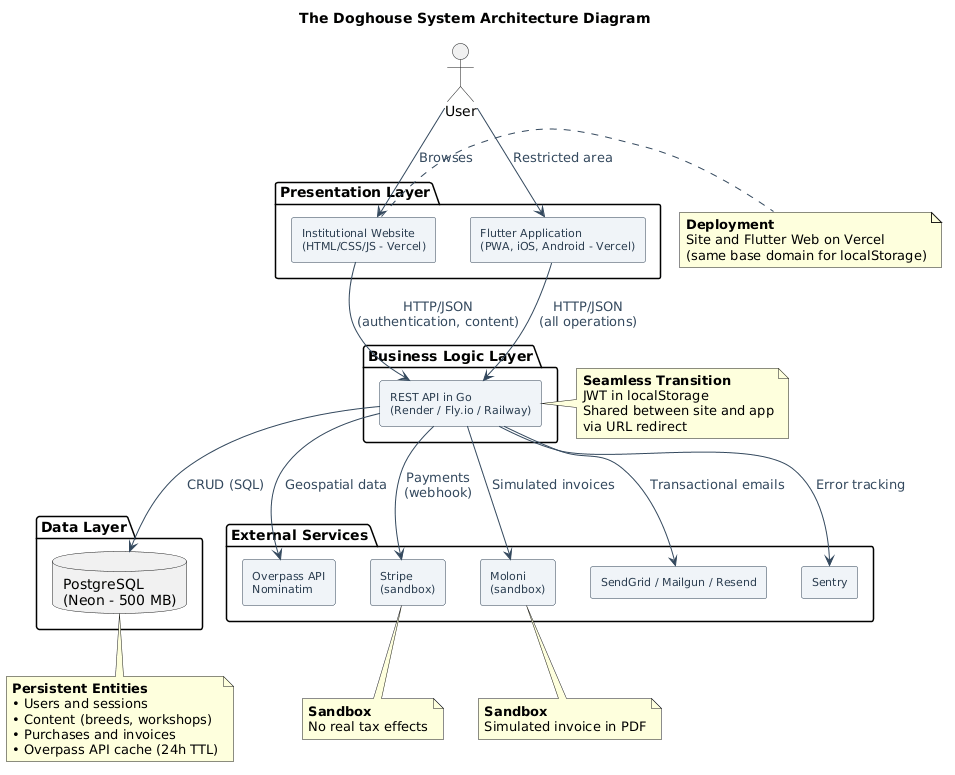

# General Architecture Design – _The Doghouse_

## 1. Introduction

This document aims to describe the overall architecture of the _The Doghouse_ system, defining the high‑level technological structure, the major components that make up the application, the technologies adopted for each, and how they communicate with each other.

The system follows a three‑tier client‑server architecture, complemented by external services. The technological choices are justified considering the _MVP_ objectives, resource constraints (free services), and the learning context of the project.

## 2. Overview of the Architecture

The _The Doghouse_ system adopts a three‑tier client‑server architecture with the following main components:

**Presentation Layer**
The presentation layer consists of two distinct components: the institutional website, developed in pure _HTML_, _CSS_, and _JavaScript_, hosted on _Vercel_, and the _Flutter_ application, compiled for the _Web_ (as a _PWA_), _iOS_, and _Android_, also hosted on _Vercel_. The institutional website is responsible for the _landing page_ and the _blog_, serving as a public entry point optimized for _SEO_. The _Flutter_ application is responsible for the restricted area, where authenticated users access the three functional areas: ideal weight calculator, _workshops_, and maps.

**Business Logic Layer**
The business logic layer is implemented by a _REST API_ developed in _Go_, hosted on a container service such as _Render_, _Fly.io_, or _Railway_. The _API_ implements all system operations, including authentication (via _magic link_ and social login), user management, conditional access to content, payment processing (via _Stripe_), simulated invoice issuance (via _Moloni_), integration with the _Overpass API_ for geospatial data retrieval, and _cache_ management.

**Data Layer**
The data layer is ensured by a relational _PostgreSQL_ database, hosted on _Neon_ (free plan with 500 MB of storage). The database stores all persistent information: users, content (breeds, _workshops_, calculator data), purchases, invoices, _Overpass API_ _cache_, and system metadata.

**External Services**
The architecture integrates several external services that complement system functionalities:

- _Overpass API_ (_OpenStreetMap_) – provision of geospatial data on _pet‑friendly_ hotels.
- _Nominatim_ (_OpenStreetMap_) – geocoding of textual addresses into coordinates.
- _Stripe_ (in _sandbox_) – payment processing and _webhook_ management.
- _Moloni_ (in _sandbox_) – issuance of simulated invoices in _PDF_.
- _SendGrid_ (or _Mailgun_, _Resend_) – sending transactional _e‑mails_ (_magic links_, purchase confirmations, welcome messages).
- _Sentry_ – error tracking in production.

_Figure 1_ presents the system architecture diagram.

_Figure 1 – Architecture diagram of The Doghouse system, illustrating the three main layers (presentation, business logic, and data), integrated external services, and communication flows between components._

## 3. Justification of Technological Choices

### 3.1. _Backend_ in _Go_

The choice of _Go_ for _backend_ development is justified for several reasons. First, _Go_ is a modern, efficient language with excellent support for concurrency, which is particularly relevant for an _API_ that may need to handle multiple simultaneous requests (authentication, database queries, calls to external services). Second, _Go_ compiles to a single binary, simplifying _deployment_ and _containerization_ with _Docker_. Third, the language is widely used in _backend_ and _REST API_ development, with an active community and good documentation, which facilitates learning – an important factor for a project with a study component. Finally, _Go_ is supported by free _deployment_ services such as _Render_, _Fly.io_, and _Railway_, with plans adequate for the _MVP_ scope.

### 3.2. _Frontend_ – Institutional Website (_HTML_/_CSS_/_JS_)

The institutional website is developed in pure _HTML_, _CSS_, and _JavaScript_, without _frameworks_. This choice is justified by the need to optimize _SEO_ and ensure fast loading, characteristics that are harder to achieve with heavy _frameworks_. The website consists of a _landing page_ and a _blog_ with static articles, functioning as a showcase for the project and a source of organic traffic. The technological simplicity allows for fast _deployment_ on static _hosting_ services such as _Vercel_.

### 3.3. _Frontend_ – _Flutter_ Application (_Web_, _iOS_, _Android_)

The _Flutter_ application is the heart of the system's restricted area. The choice of _Flutter_ is justified by its ability to compile for three platforms (_Web_ as _PWA_, _iOS_, and _Android_) from a single codebase, eliminating duplication of effort and ensuring consistency of interface and functionality across all platforms. _Flutter_ is a modern technology with an active community and excellent documentation, and its reactive _widget_ model allows for building rich and dynamic interfaces efficiently. Configuration as a _PWA_ allows direct installation from the browser, complementing publication on the official stores.

### 3.4. Database – _PostgreSQL_ (_Neon_)

The choice of a relational database (_PostgreSQL_) is justified by the structured nature of the system data – users, purchases, content, _cache_ – and the need for referential integrity and transactional consistency. _PostgreSQL_ is a mature database with native _JSON_ support (useful for metadata or configurations) and is widely supported by free services. _Neon_ was chosen as the hosting service for offering a free plan with 500 MB of storage, without the need for periodic renewal, and for providing features such as _point‑in‑time recovery_ and _branches_ for development.

### 3.5. Containerization – _Docker_

_Docker_ is used to _containerize_ the _Go_ _backend_, the _PostgreSQL_ database, and the _proxy_ (if necessary). _Containerization_ ensures consistency between development and production environments, simplifies _deployment_, and facilitates environment replication by other developers – an important factor for a public project on _GitHub_.

### 3.6. External Services

- **_Overpass API_ and _Nominatim_** – are free public services from _OpenStreetMap_. The _Overpass API_ allows structured queries to geospatial data (_pet‑friendly_ hotels), while _Nominatim_ offers geocoding (converting text to coordinates). They are suitable choices for an _MVP_ as they do not require _API_ keys and have accessible documentation.
- **_Stripe_ (in _sandbox_)** – is one of the most widely used payment gateways, with a _sandbox_ mode that allows simulating payments without real effects. The integration with _webhooks_ is well documented and the platform offers a free plan adequate for the _MVP_.
- **_Moloni_ (in _sandbox_)** – is a Portuguese invoicing system with _sandbox_ environment support. It allows issuing simulated invoices in _PDF_, demonstrating the invoicing flow without real tax effects.
- **_SendGrid_ (or _Mailgun_, _Resend_)** – are transactional email services with free plans, used for sending _magic links_, purchase confirmations, and welcome _e‑mails_.
- **_Sentry_** – is an error tracking platform with a free plan, used to monitor production failures.

### 3.7. Hosting

- **Institutional website and _Flutter_ Web application** – _Vercel_ (same base domain, allowing _localStorage_ sharing for _seamless_ transition).
- **_Backend_ (_Go_)** – _Render_, _Fly.io_, or _Railway_, services that support _Docker_ containers and offer free plans with acceptable limitations for an _MVP_ (e.g., _cold starts_).
- **Database (_PostgreSQL_)** – _Neon_, with a free 500 MB plan and no need for periodic renewal.

These choices ensure that the prototype can be made publicly available at no cost, fulfilling the demonstration and learning requirements.

## 4. Description of Components and Flows

### 4.1. System Components

**Institutional Website (_HTML_/_CSS_/_JS_)**
The institutional website consists of a _landing page_ and a _blog_ with static articles. The _landing page_ presents the project, its benefits, and a call to action for registration. The _blog_ contains articles about dog care and curiosities, serving as organic content to attract visitors. The website is accessible to all visitors without authentication and includes a button to access the restricted area in the _Flutter_ application.

**_Flutter_ Application (_Web_, _iOS_, _Android_)**
The _Flutter_ application is the main interface for the system's restricted area. It contains three functional areas:

- **Ideal Weight Calculator** – allows the user to select the breed and age of the dog, returning an approximate value (free version) or a complete table with percentiles and recommendations (premium version).
- **Workshops Area** – organized by breed, with free introductory videos and paid videos on specific care, nutrition, training, and health.
- **Maps Area** – interactive map for searching _pet‑friendly_ hotels, with search by current location (Near Me) or by text location (e.g., "Porto").

The application also includes a profile area, where the user can view their purchase history, acquired content, and invoices.

**_Backend_ in _Go_ (_REST API_)**
The _REST API_ in _Go_ is responsible for all the system's business logic. It is organized in layers:

- **Routes layer** – defines the _API_ _endpoints_ and associates each route with the respective controller.
- **Controllers layer** – receives requests, validates _inputs_, calls the appropriate services, and returns responses in _JSON_ format.
- **Services layer** – contains the business logic (authentication, content management, payment processing, _Overpass API_ integration, etc.).
- **Data Access layer** – interacts with the _PostgreSQL_ database through an _ORM_ or parameterized _queries_.

**_PostgreSQL_ Database**
The database stores all system entities:

- Users (with access profiles and purchase history)
- Content (breeds, _workshops_, calculator data)
- Purchases and invoices
- _Overpass API_ _cache_ (with 24‑hour TTL)

### 4.2. Interaction Flows

Communication between the _frontend_ and the _backend_ is carried out through _HTTP_ requests to the _REST API_, exchanging messages in _JSON_ format. To illustrate the interactions, some representative examples are presented:

**Authentication and Registration**

- `POST /api/auth/register` – registers a new user (after _magic link_ validation).
- `POST /api/auth/magic-link` – requests the sending of a _magic link_ to the provided email.
- `GET /api/auth/verify/{token}` – validates the _magic link_ and authenticates the user.
- `POST /api/auth/social` – authentication via social login (_Google_/_Facebook_).

**Ideal Weight Calculator**

- `GET /api/calculator/breeds` – retrieves the list of available breeds.
- `GET /api/calculator/weight?breed={breed}&age={age}` – calculates the ideal weight (free version).
- `GET /api/calculator/premium?breed={breed}&age={age}` – calculates the ideal weight with complete table (premium version, requires authentication and purchase verification).

**_Workshops_**

- `GET /api/workshops` – retrieves the list of breeds with introductory videos (accessible to all authenticated users).
- `GET /api/workshops/{breed}` – retrieves the list of videos for a breed (paid videos only if the user has purchased the content).
- `POST /api/workshops/purchase` – records the purchase of a video or _bundle_ (integration with _Stripe_).

**Maps**

- `GET /api/maps/hotels?lat={lat}&lng={lng}&north={north}&south={south}&east={east}&west={west}` – retrieves _pet‑friendly_ hotels in the current _viewport_ (queries _cache_ or _Overpass API_).
- `GET /api/maps/geocode?address={address}` – geocodes a text address via _Nominatim_.

**Payments and Invoicing**

- `POST /api/payments/create-checkout` – creates a _checkout_ session on _Stripe_.
- `POST /api/payments/webhook` – _endpoint_ for the _Stripe_ _webhook_ (payment processing).
- `GET /api/profile/invoices` – retrieves the list of invoices for the authenticated user.
- `GET /api/invoices/{id}` – retrieves details of a specific invoice (public _URL_ from _Moloni_).

**Profile and Content**

- `GET /api/profile` – retrieves the user's profile data.
- `PUT /api/profile` – updates the user's profile data (name).
- `GET /api/profile/purchases` – retrieves the purchase history and acquired content.

### 4.3. Integration with External Services

**_Overpass API_ (_OpenStreetMap_)**
The _backend_ queries the _Overpass API_ to obtain _pet‑friendly_ hotels based on the _viewport_ coordinates and the tags `dog=yes` or `pets=yes`. Results are stored in the database _cache_ with a 24‑hour TTL to avoid excessive queries to the external _API_.

**_Nominatim_ (_OpenStreetMap_)**
The _backend_ uses _Nominatim_ to geocode text addresses (e.g., "Porto") into geographic coordinates (latitude and longitude), allowing text‑based location search in the maps area.

**_Stripe_ (in _sandbox_)**
The _backend_ integrates with _Stripe_ to create _checkout_ sessions and process payment _webhooks_. Payments are simulated in a _sandbox_ environment, without real effects.

**_Moloni_ (in _sandbox_)**
The _backend_ integrates with _Moloni_ to generate simulated invoices in _PDF_ after each successful purchase. Invoices are stored in the database through the public _URL_ provided by _Moloni_.

**_SendGrid_ (or _Mailgun_, _Resend_)**
The _backend_ uses a transactional email service to send _magic links_, purchase confirmations, and welcome _e‑mails_.

**_Sentry_**
The _backend_ integrates _Sentry_ for error tracking in production, allowing monitoring of failures and exceptions.

## 5. Containerization Strategy with _Docker_

_Docker_ _containerization_ is used to ensure consistency between development and production environments, simplify _deployment_, and facilitate environment replication by other developers. The strategy includes:

- **_Go_ _backend_ container** – _Docker_ image that compiles the _Go_ application and runs it as an _HTTP_ service.
- **_PostgreSQL_ database container** – official _PostgreSQL_ _Docker_ image, with data persistence through _volumes_.
- **Orchestration with _Docker Compose_** – `docker-compose.yml` file that defines and orchestrates the containers for the development environment, including the database, the _backend_, and (if necessary) a _proxy_.

_Docker Compose_ allows starting the entire environment with a single command (`docker-compose up`), facilitating development and local testing. For production, containers are individually deployed on services such as _Render_, _Fly.io_, or _Railway_.

## 6. Session Sharing Strategy Between Website and Application

The _seamless_ transition between the institutional website (_HTML_/_CSS_/_JS_) and the _Flutter_ application is implemented through sharing a JWT token between the two components.

**Sharing mechanism:**

1. The user authenticates via _magic link_ or social login, and the _backend_ generates a JWT token with a 7‑day validity.
2. The token is stored in _localStorage_ in the browser.
3. When the user navigates from the _HTML_ website to the _Flutter_ application, the system redirects to the application with the JWT token in the _URL_ (e.g., `app.thedoghouse.vercel.app?token=JWT_TOKEN`).
4. The _Flutter_ application extracts the token from the _URL_, stores it in _localStorage_, and validates it with the _backend_ to restore the session.
5. The session is maintained while the token is valid (7 days), being renewable upon re‑authentication.

**Requirements for sharing:**

- The institutional website and the _Flutter_ Web application are hosted on the same base domain (e.g., both on _Vercel_), allowing _localStorage_ sharing between subdomains.
- The _backend_ validates the JWT token on each authenticated request, ensuring that only users with an active session access restricted resources.
- _CORS_ is configured on the _backend_ to allow requests from authorized subdomains.

## 7. Final Considerations on the Architecture

The adopted architecture is adequate for the _MVP_ objectives, as it clearly separates responsibilities, facilitates maintenance, and allows _deployment_ on free services. The technological choices (_Go_, _Flutter_, _PostgreSQL_, _Docker_) are modern, widely documented, and provide a reasonable learning curve – an important factor for a project with a study component.

The inclusion of external services (_Overpass API_, _Nominatim_, _Stripe_, _Moloni_, _SendGrid_, _Sentry_) solves complex functionalities without reinventing the wheel, allowing the development focus to be on business logic and integration between components.

The architecture naturally supports system requirements: modern authentication (_magic links_ and social login), conditional access to content, payment processing, invoice issuance, integration with external _APIs_, and _seamless_ transition between the website and the application. In future iterations, the architecture can be extended (for example, by adding _push_ notifications, integrating with more payment services, or a content recommendation system) without the need to restructure the fundamental layers.
