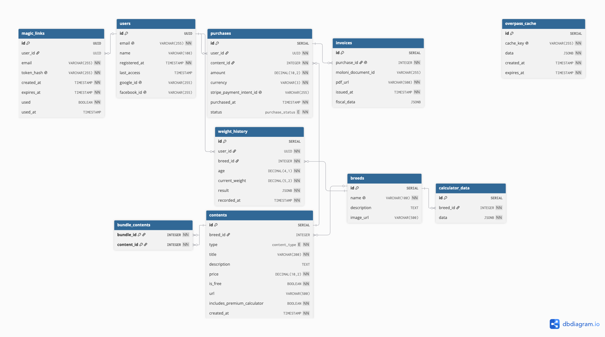

# Database Modeling – _The Doghouse_

## 1. Introduction

The database modeling of the _The Doghouse_ system defines the structure that will store all persistent information required for the prototype's operation. A relational model was chosen, implemented in _PostgreSQL_ on the _Neon_ service, to ensure referential integrity, transaction support, and ease of querying.

The modeling decisions were based on the functional requirements, user profiles, and previously defined flows, aiming to balance normalization with the efficiency of the most frequent operations. The final model consists of ten main tables, reflecting the _MVP_'s simplicity and the focus on business logic (authentication, content management, purchases, and invoicing) rather than complex administrative functionalities.

All table, column, key, and constraint names are in English to ensure consistency with the application code (_Go_ and _Flutter_). Descriptions and modeling notes are presented in Portuguese for ease of understanding.

## 2. Entities, Attributes, and Relationships

The following sections present the entities that compose the model, grouped by functional domain. For each table, the main attributes, keys, and relevant notes on modeling decisions are described.

### 2.1. Users and Authentication

#### `users`

The `users` table stores the data of all platform users. A single table was chosen since the attributes are common to all profiles and there are no administrative functionalities within the _MVP_ scope. Premium content access is not stored as a boolean field, being derived instead from the existence of purchases in the `purchases` table.

| Field           | Type           | Description                                   | Constraints                     |
| --------------- | -------------- | --------------------------------------------- | ------------------------------- |
| `id`            | `UUID`         | Unique user identifier                        | Primary key, auto-generated     |
| `email`         | `VARCHAR(255)` | Email address                                 | Unique, required                |
| `name`          | `VARCHAR(100)` | User's name                                   | Optional                        |
| `registered_at` | `TIMESTAMP`    | Registration date and time                    | Required, auto-generated        |
| `last_access`   | `TIMESTAMP`    | Last access date and time                     | Optional, updated on each login |
| `google_id`     | `VARCHAR(255)` | User's Google identifier (for social login)   | Optional, unique                |
| `facebook_id`   | `VARCHAR(255)` | User's Facebook identifier (for social login) | Optional, unique                |

**Modeling notes:** The `email` field is unique and serves as the natural key for user identification. The `google_id` and `facebook_id` fields allow associating the user account with their respective social login providers. The premium status is derived: a user has access to a specific content if there is a purchase with `status = 'completed'` associated with that content (or a bundle that includes it). There is no global `is_premium` field, in accordance with the business rule that "access is conditional and there is no global premium status."

#### `magic_links`

The `magic_links` table records all magic link authentication requests, enabling the implementation of a 15-minute validity period, single-use, and rate limiting of 5 attempts per hour.

| Field        | Type           | Description                                      | Constraints                          |
| ------------ | -------------- | ------------------------------------------------ | ------------------------------------ |
| `id`         | `UUID`         | Unique link identifier                           | Primary key, auto-generated          |
| `user_id`    | `UUID`         | User identifier (if already exists)              | Foreign key to `users(id)`, optional |
| `email`      | `VARCHAR(255)` | Email to which the link was sent                 | Required                             |
| `token_hash` | `VARCHAR(255)` | Token hash (never store the token in plain text) | Unique, required                     |
| `created_at` | `TIMESTAMP`    | Link creation date and time                      | Required, auto-generated             |
| `expires_at` | `TIMESTAMP`    | Expiration date and time (creation + 15 minutes) | Required                             |
| `used`       | `BOOLEAN`      | Indicates whether the link has been consumed     | Default: `false`                     |
| `used_at`    | `TIMESTAMP`    | Date and time when it was consumed               | Optional                             |

**Modeling notes:** The `token_hash` stores only the hash (e.g., SHA‑256) of the token sent by email, never the plain value – thus, even with database access, it is not possible to reconstruct valid links. The query `SELECT COUNT(*) FROM magic_links WHERE email = ? AND created_at > NOW() - INTERVAL '1 hour'` implements the rate limiting from RNF13 (maximum of 5 attempts per hour). The `user_id` field allows tracking all magic links of an existing user, complementing the email-based query. Records with an expiration date prior to the current date can be periodically cleaned up by a background job.

### 2.2. Content and Catalogs

#### `breeds`

The `breeds` table stores the dog breeds available in the ideal weight calculator and the workshops area. Each breed is identified by a unique name.

| Field         | Type           | Description                           | Constraints      |
| ------------- | -------------- | ------------------------------------- | ---------------- |
| `id`          | `SERIAL`       | Unique breed identifier               | Primary key      |
| `name`        | `VARCHAR(100)` | Breed name                            | Unique, required |
| `description` | `TEXT`         | General breed description             | Optional         |
| `image_url`   | `VARCHAR(500)` | URL of the representative breed image | Optional         |

**Modeling notes:** The breed is the central entity that organizes content. Both the calculator and the workshops are structured based on the breed.

#### `calculator_data`

The `calculator_data` table stores the reference data for the ideal weight calculator – weight tables by age, percentiles, and recommendations. This data is catalog-like and always accessible to all users (the free version returns an approximate value; the premium version returns the complete table). The difference between versions is a backend decision, not a restricted access to the table row.

| Field      | Type      | Description                                        | Constraints                           |
| ---------- | --------- | -------------------------------------------------- | ------------------------------------- |
| `id`       | `SERIAL`  | Unique identifier                                  | Primary key                           |
| `breed_id` | `INTEGER` | Associated breed                                   | Foreign key to `breeds(id)`, required |
| `data`     | `JSONB`   | Weight tables by age, percentiles, recommendations | Required                              |

**Modeling notes:** The `data` field in `JSONB` contains the complete structure of the calculator data for each breed. Example:

```json
{
  "age_ranges": [
    { "age": 3, "weight_min": 5.0, "weight_max": 7.5, "percentile_50": 6.2 },
    { "age": 6, "weight_min": 7.0, "weight_max": 10.0, "percentile_50": 8.5 }
  ],
  "recommendations": "High-protein diet..."
}
```

The backend decides, based on the existence of a purchase of `calculator_premium_access` (or a bundle that includes it), whether to return only the approximate value or the complete table.

#### `contents`

The `contents` table represents items that can be purchased by users, including workshop videos, video bundles, and premium calculator access. The calculator reference data (weight tables) are **not** purchasable content, being stored in the `calculator_data` table.

| Field                         | Type            | Description                                                         | Constraints                                         |
| ----------------------------- | --------------- | ------------------------------------------------------------------- | --------------------------------------------------- |
| `id`                          | `SERIAL`        | Unique content identifier                                           | Primary key                                         |
| `breed_id`                    | `INTEGER`       | Associated breed identifier                                         | Foreign key to `breeds(id)`, optional (videos only) |
| `type`                        | `ENUM`          | Content type (`'video'`, `'bundle'`, `'calculator_premium_access'`) | Required                                            |
| `title`                       | `VARCHAR(200)`  | Content title                                                       | Required                                            |
| `description`                 | `TEXT`          | Detailed description                                                | Optional                                            |
| `price`                       | `DECIMAL(10,2)` | Content price (in euros)                                            | Required                                            |
| `is_free`                     | `BOOLEAN`       | Indicates if content is free (e.g., introductory video)             | Default: `false`                                    |
| `url`                         | `VARCHAR(500)`  | Video URL (for `'video'` type) or thumbnail image URL               | Optional                                            |
| `includes_premium_calculator` | `BOOLEAN`       | Indicates if the bundle includes premium calculator access          | Default: `false`, only for `type = 'bundle'`        |
| `created_at`                  | `TIMESTAMP`     | Content creation date and time                                      | Required, auto-generated                            |

**Modeling notes:** The `type` column distinguishes the different content types. The `breed_id` field is required only for videos (associated with a specific breed) and optional for `'bundle'` and `'calculator_premium_access'`. The `includes_premium_calculator` field replaces the need for `JSONB` for this metadata, simplifying the model. The contents included in a bundle are managed through the `bundle_contents` association table, ensuring real referential integrity.

#### `bundle_contents`

The `bundle_contents` table establishes the many-to-many relationship between a `'bundle'` type content and the individual videos that compose it.

| Field        | Type      | Description                             | Constraints                             |
| ------------ | --------- | --------------------------------------- | --------------------------------------- |
| `bundle_id`  | `INTEGER` | Bundle identifier                       | Foreign key to `contents(id)`, required |
| `content_id` | `INTEGER` | Video identifier included in the bundle | Foreign key to `contents(id)`, required |

**Modeling notes:** The primary key is composed of `(bundle_id, content_id)`, ensuring no duplicates. This table maintains referential integrity: if a video is removed, the relationship is automatically deleted (with `ON DELETE CASCADE` set), avoiding bundles with references to non-existent content.

### 2.3. Purchases and Invoicing

#### `purchases`

The `purchases` table records all transactions made by users, associating a user with a purchased content.

| Field                      | Type            | Description                                              | Constraints                             |
| -------------------------- | --------------- | -------------------------------------------------------- | --------------------------------------- |
| `id`                       | `SERIAL`        | Unique purchase identifier                               | Primary key                             |
| `user_id`                  | `UUID`          | User who made the purchase                               | Foreign key to `users(id)`, required    |
| `content_id`               | `INTEGER`       | Purchased content identifier                             | Foreign key to `contents(id)`, required |
| `amount`                   | `DECIMAL(10,2)` | Amount paid (in euros)                                   | Required                                |
| `currency`                 | `VARCHAR(3)`    | Currency of the amount (ISO 4217)                        | Default: `'EUR'`                        |
| `stripe_payment_intent_id` | `VARCHAR(255)`  | Stripe PaymentIntent identifier                          | Unique, optional                        |
| `purchased_at`             | `TIMESTAMP`     | Purchase date and time                                   | Required, auto-generated                |
| `status`                   | `ENUM`          | Purchase status (`'pending'`, `'completed'`, `'failed'`) | Default: `'pending'`                    |

**Modeling notes:** The `stripe_payment_intent_id` column allows tracking the transaction in Stripe and associating it with the confirmation webhook. The `status` field distinguishes pending purchases from confirmed or failed ones. The `currency` field prepares the model for potential future internationalization, with `'EUR'` as the default for the _MVP_. The purchase is recorded only after the Stripe webhook is successfully processed. Refunds are out of the _MVP_ scope, so the `'refunded'` status is not included.

#### `invoices`

The `invoices` table stores the reference to invoices generated by _Moloni_ (in a _sandbox_ environment) for each successful purchase.

| Field                | Type           | Description                                        | Constraints                                      |
| -------------------- | -------------- | -------------------------------------------------- | ------------------------------------------------ |
| `id`                 | `SERIAL`       | Unique invoice identifier                          | Primary key                                      |
| `purchase_id`        | `INTEGER`      | Associated purchase identifier                     | Foreign key to `purchases(id)`, required, unique |
| `moloni_document_id` | `VARCHAR(255)` | Document identifier in Moloni                      | Optional                                         |
| `pdf_url`            | `VARCHAR(500)` | Public PDF invoice URL, provided by Moloni         | Required                                         |
| `issued_at`          | `TIMESTAMP`    | Invoice issuance date and time                     | Required, auto-generated                         |
| `fiscal_data`        | `JSONB`        | User identification data for the simulated invoice | Optional                                         |

**Modeling notes:** The relationship between `invoices` and `purchases` is 1:1, enforced by the `UNIQUE` constraint on `purchase_id`. The `pdf_url` field is the main reference for the user to view and download the invoice. The `fiscal_data` field in `JSONB` stores the user identification data used in the simulated invoice, with the following schema:

```json
{
  "name": "João Silva",
  "email": "joao@exemplo.pt"
}
```

Invoices are simulated in a _sandbox_ environment with no legal value, so no tax ID or address is collected.

### 2.4. _Overpass API_ Cache

#### `overpass_cache`

The `overpass_cache` table stores the results of queries to the _Overpass API_ to avoid excessive requests to the external service, improving performance and respecting the _API_ usage limits.

| Field        | Type           | Description                                                                  | Constraints                                |
| ------------ | -------------- | ---------------------------------------------------------------------------- | ------------------------------------------ |
| `id`         | `SERIAL`       | Unique cache record identifier                                               | Primary key                                |
| `cache_key`  | `VARCHAR(255)` | Unique key identifying the query                                             | Unique, required                           |
| `data`       | `JSONB`        | Query result in _JSON_ format (hotels with name, address, coordinates, tags) | Required                                   |
| `created_at` | `TIMESTAMP`    | Record creation date and time                                                | Required, auto-generated                   |
| `expires_at` | `TIMESTAMP`    | Record expiration date and time (TTL of 24 hours)                            | Required, calculated as `created_at + 24h` |

**Modeling notes:** The `cache_key` column is built based on the query parameters, with coordinates rounded to 2 decimal places (~1.1 km precision), avoiding multiple entries for practically identical queries.

Key format: `lat_min|lat_max|lng_min|lng_max` (rounded coordinates)

Example: `"41.14|41.16|-8.63|-8.61"`

The `expires_at` field allows identifying obsolete records, which can be periodically removed by a background job or simply ignored in queries.

### 2.5. Weight History (RF13)

#### `weight_history`

The `weight_history` table stores the history of calculator queries made by premium users, allowing future consultation of results.

| Field            | Type           | Description                                                             | Constraints                           |
| ---------------- | -------------- | ----------------------------------------------------------------------- | ------------------------------------- |
| `id`             | `SERIAL`       | Unique identifier                                                       | Primary key                           |
| `user_id`        | `UUID`         | User who recorded the weight                                            | Foreign key to `users(id)`, required  |
| `breed_id`       | `INTEGER`      | Breed consulted                                                         | Foreign key to `breeds(id)`, required |
| `age`            | `DECIMAL(4,1)` | Dog's age at the time of the query                                      | Required                              |
| `current_weight` | `DECIMAL(5,2)` | Dog's weight at the time of the query (kg)                              | Required                              |
| `result`         | `JSONB`        | Result returned by the calculator (weight, percentile, recommendations) | Required                              |
| `recorded_at`    | `TIMESTAMP`    | Registration date                                                       | Required, auto-generated              |

**Modeling notes:** This table implements RF13 (Results History), allowing premium users to save calculator results for future consultation. The premium access restriction is not enforced at the database level – the backend validates access before inserting records into this table, following the algorithm described in section 2.6. The table is populated only when the user has premium access (via direct purchase or bundle) and chooses to save the result.

### 2.6. Content Access Resolution Logic

A user's access to a specific content is verified through the following algorithm:

1. **Direct access:** Is there a purchase with `status = 'completed'` and `content_id` equal to the requested content? → Access granted.
2. **Access via bundle:** Is there a purchase with `status = 'completed'` of a `content` of type `'bundle'`, whose `bundle_id` is associated with the requested `content_id` in the `bundle_contents` table? → Access granted.
3. **Premium calculator access:** Is there a direct purchase of `calculator_premium_access` with `status = 'completed'` OR a purchase with `status = 'completed'` of a bundle whose `includes_premium_calculator = true`? → Access granted to the complete calculator.
4. **Access denied:** If none of the conditions are met, the content is presented as locked.

This algorithm must be implemented in the backend when querying content, ensuring that the _API_ response correctly reflects the user's access.

### 2.7. JWT Invalidation Strategy

The system uses JWT tokens with a 7‑day validity period to maintain the user session. Within the _MVP_ scope, there is no active token invalidation mechanism – logout is exclusively client‑side (removal of the token from `localStorage`).

This is a conscious decision adequate for the prototype scope, since:

- The token has a short validity period (7 days), limiting the exposure window in case of compromise.
- Server‑side forced logout is not a _MVP_ requirement.
- Implementing a token blacklist would add unnecessary complexity to the prototype.

If needed in the future, a `token_revoked` table with `jti` (JWT ID) and `expires_at` fields could be added to invalidate specific tokens.

## 3. Entity Relationships

The entity‑relationship diagram (ERD) presented in Figure 1 illustrates the relationships between the tables, with their respective cardinalities.

- **Users (1) ─ (N) Purchases** – A user can make multiple purchases; each purchase belongs to a single user.
- **Purchases (N) ─ (1) Contents** – A purchase refers to a single content; a content can be purchased by multiple users.
- **Purchases (1) ─ (1) Invoices** – Each purchase has a single associated invoice; each invoice corresponds to a single purchase.
- **Contents (N) ─ (1) Breeds** – Each content belongs to a breed (only for videos; `'bundle'` and `'calculator_premium_access'` do not have `breed_id`).
- **Bundle_Contents (N) ─ (1) Contents** – Each bundle can include multiple videos; each video can be included in multiple bundles.
- **Calculator_Data (N) ─ (1) Breeds** – Each breed has a set of calculator data; each calculator record belongs to a breed.
- **Weight_History (N) ─ (1) Users** – Each user can have multiple weight records; each record belongs to a user.
- **Weight_History (N) ─ (1) Breeds** – Each weight record refers to a breed; a breed can appear in multiple records.
- **Magic_Links (N) ─ (1) Users** – Each magic link can be associated with a user (if they already exist); a user can have multiple links.

**Summary of cardinalities:**

| Relationship                        | Cardinality         |
| ----------------------------------- | ------------------- |
| Users → Purchases                   | 1 : N               |
| Purchases → Users                   | N : 1               |
| Purchases → Contents                | N : 1               |
| Contents → Purchases                | 1 : N               |
| Purchases → Invoices                | 1 : 1               |
| Invoices → Purchases                | 1 : 1               |
| Contents → Breeds                   | N : 1 (videos only) |
| Breeds → Contents                   | 1 : N               |
| Bundle_Contents → Contents (bundle) | N : 1               |
| Bundle_Contents → Contents (video)  | N : 1               |
| Calculator_Data → Breeds            | N : 1               |
| Breeds → Calculator_Data            | 1 : N               |
| Weight_History → Users              | N : 1               |
| Users → Weight_History              | 1 : N               |
| Weight_History → Breeds             | N : 1               |
| Breeds → Weight_History             | 1 : N               |
| Magic_Links → Users                 | N : 1 (optional)    |

## 4. Recommended Indexes

To ensure performance for the most frequent operations, the creation of the following indexes is recommended:

| Table             | Column(s)           | Index Type          | Justification                                |
| ----------------- | ------------------- | ------------------- | -------------------------------------------- |
| `users`           | `email`             | `UNIQUE`            | Authentication and profile query             |
| `users`           | `google_id`         | `UNIQUE`            | Social login                                 |
| `users`           | `facebook_id`       | `UNIQUE`            | Social login                                 |
| `purchases`       | `user_id`           | `BTREE`             | Query purchases by user                      |
| `purchases`       | `content_id`        | `BTREE`             | Access verification to content               |
| `purchases`       | `(user_id, status)` | `BTREE` (composite) | Query completed purchases by a specific user |
| `overpass_cache`  | `cache_key`         | `UNIQUE`            | Cache query by key                           |
| `magic_links`     | `token_hash`        | `UNIQUE`            | Token validation                             |
| `magic_links`     | `email`             | `BTREE`             | Rate limiting by email                       |
| `magic_links`     | `user_id`           | `BTREE`             | Query links by user                          |
| `weight_history`  | `user_id`           | `BTREE`             | Query history by user                        |
| `contents`        | `breed_id`          | `BTREE`             | Query content by breed (videos)              |
| `contents`        | `type`              | `BTREE`             | Filtering by content type                    |
| `bundle_contents` | `bundle_id`         | `BTREE`             | Query content of a bundle                    |
| `bundle_contents` | `content_id`        | `BTREE`             | Check if a content is in a bundle            |

## 5. Entity‑Relationship Diagram (ERD)

Figure 1 presents the complete entity‑relationship diagram of the _The Doghouse_ database, showing all ten tables, their attributes (with primary and foreign keys indicated), and the relationships with their respective cardinalities. The connections between tables follow the definitions described throughout this section.



_Figure 1 – Entity‑relationship diagram of the The Doghouse database._

## 6. Final Considerations on the Modeling

The proposed relational database is normalized, avoiding unnecessary redundancies and ensuring data consistency. Foreign keys ensure referential integrity, and `UNIQUE` fields (such as `email` in `users` and `stripe_payment_intent_id` in `purchases`) enforce the necessary uniqueness constraints.

The use of the `JSONB` type in _PostgreSQL_ for the `data` fields (in `calculator_data` and `overpass_cache`) and `fiscal_data` (in `invoices`) adds flexibility to the model, allowing structured data storage without the need to create additional tables for each content variation or fiscal data type. The simplification of the `includes_premium_calculator` field as a direct boolean in `contents` avoids unnecessary `JSONB` for a single metadata field.

The separation between `calculator_data` (catalog, always accessible) and premium access (purchasable product, `calculator_premium_access`) resolves the ambiguity of the original model and aligns with the functional requirements (RF12). The `magic_links` table correctly implements magic link authentication, with 15‑minute validity, single‑use, and rate limiting. The absence of a global `is_premium` field in the `users` table reflects the fundamental business rule: access is conditional and based on specific purchases.

The introduction of the `bundle_contents` table ensures real referential integrity for bundle content, avoiding silent inconsistencies that would occur with `JSONB` storage of identifiers without foreign key validation. The `overpass_cache` table is a key element for performance optimization in the maps area, preventing excessive queries to the _Overpass API_ and ensuring fast response times for users. The `weight_history` table supports RF13, allowing premium users to save calculator results for future consultation.

The model allows answering operational questions such as:

- **Does a user have access to this specific content?** – Query the `purchases` table with `user_id` and `content_id` (or bundle verification through the `bundle_contents` table).
- **What are the best-selling content items?** – Query the `purchases` table grouped by `content_id`.
- **What is the total amount invoiced by a user?** – Sum of purchase amounts for a specific user.
- **Is the _Overpass API_ cache being used efficiently?** – Analysis of the percentage of cache hits versus external _API_ calls.
- **Which breeds are most consulted in the calculator?** – Query the `weight_history` table grouped by `breed_id`.

These queries are fundamental for ecosystem management, allowing content offering optimization, understanding user behavior, and improving the overall platform experience.

The model is prepared to grow with the project: new entities (e.g., reviews, comments, notifications) can be added in future versions without requiring restructuring of existing tables, thanks to the clear separation of responsibilities and the use of flexible data types like `JSONB`.
