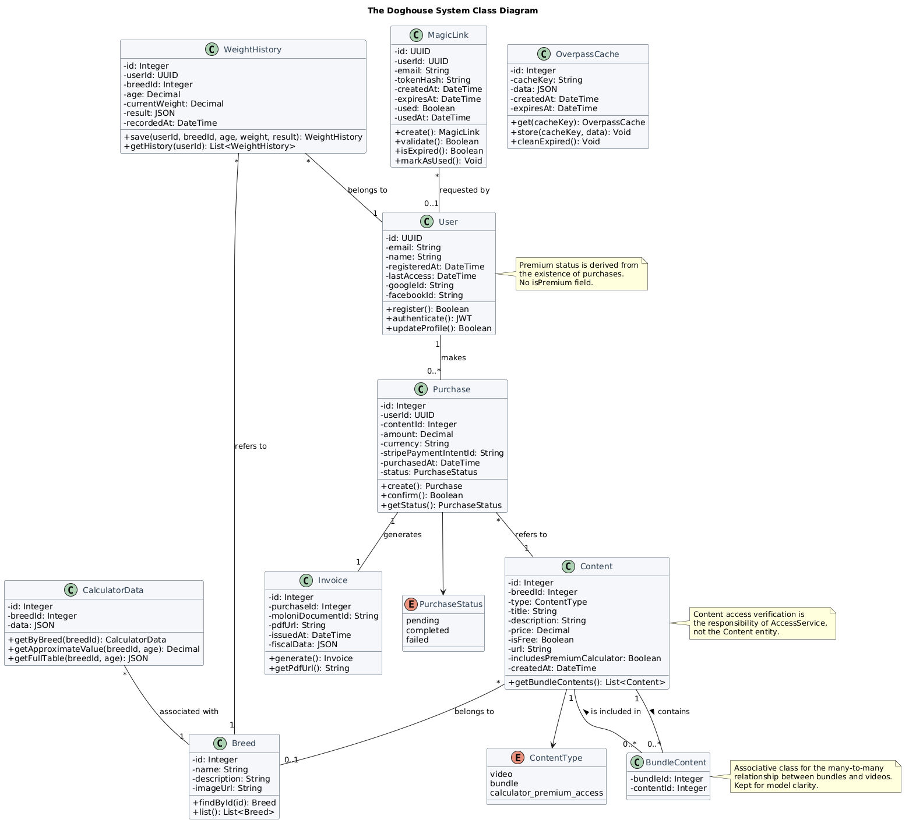
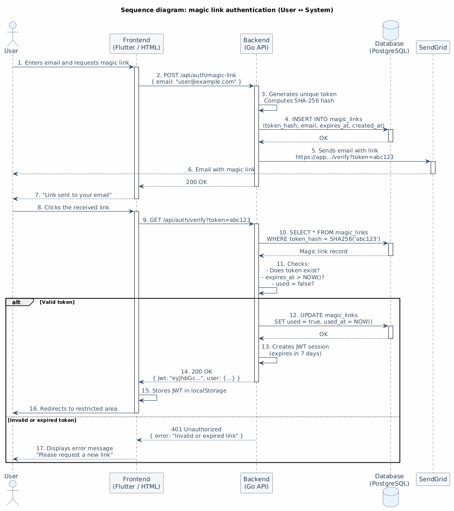
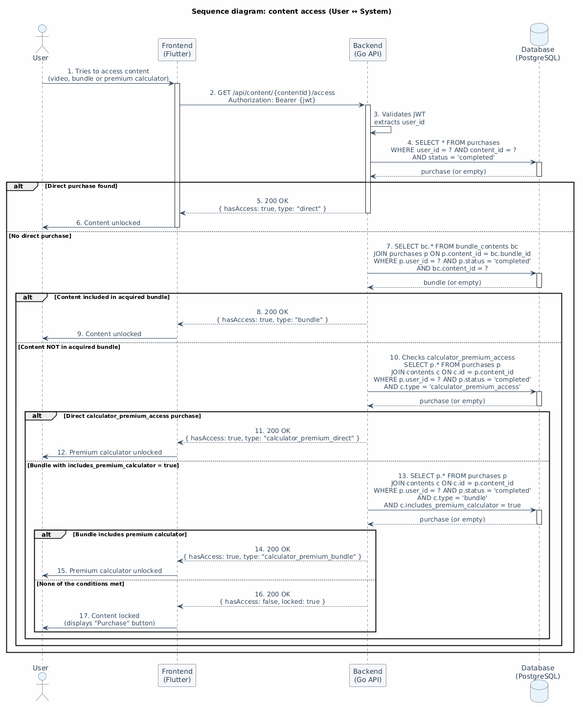
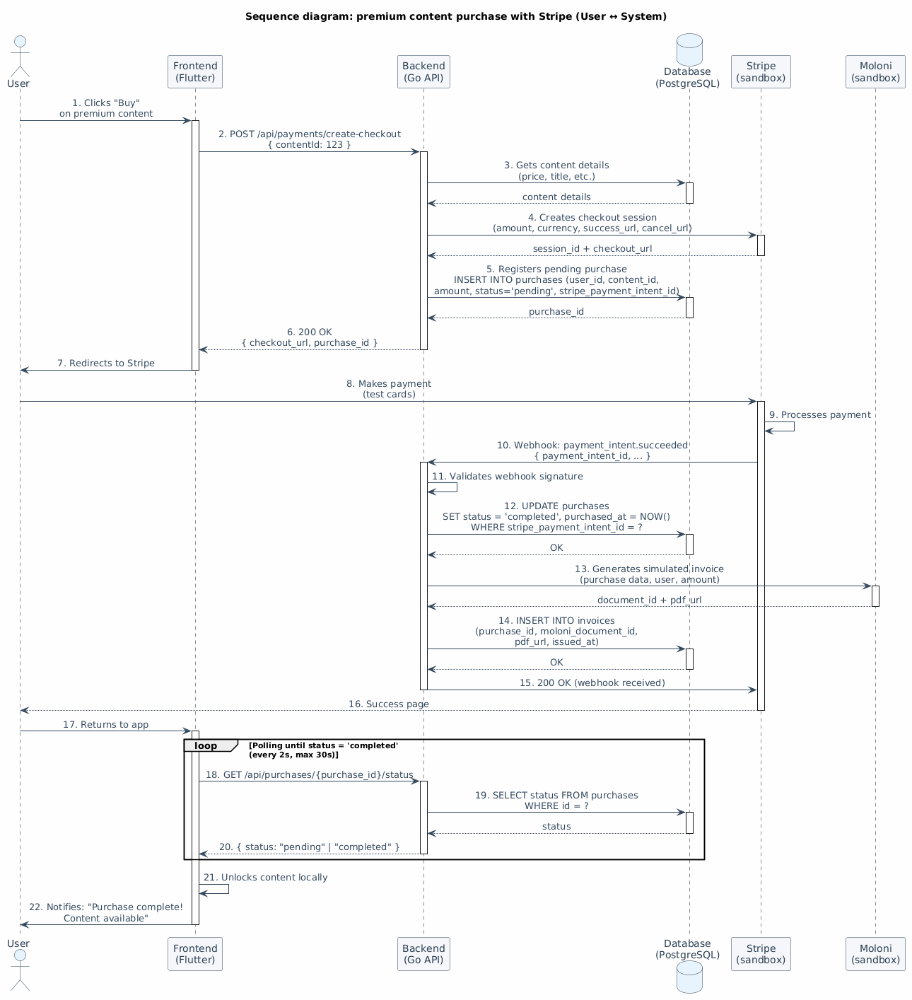
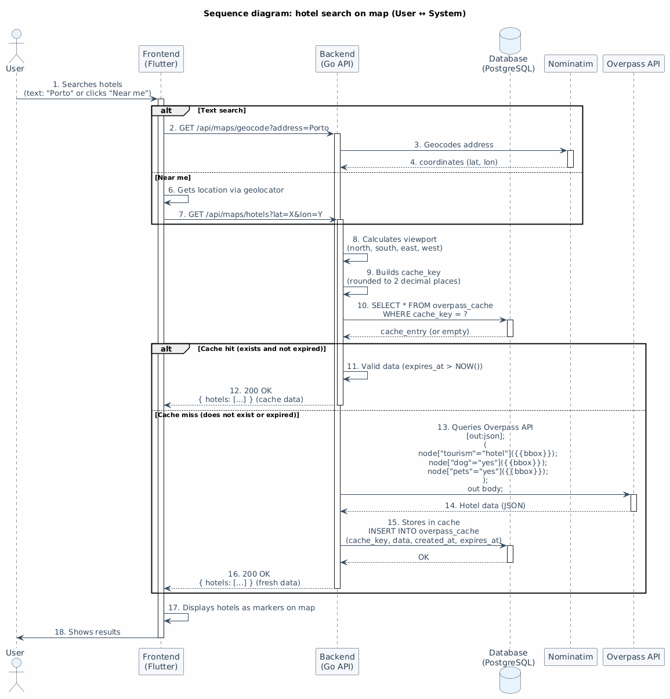

# UML Diagrams (Classes and Sequence) – _The Doghouse_

## 1. Introduction

UML (_Unified Modeling Language_) diagrams complement the structural and dynamic modeling of the _The Doghouse_ system. While the relational model and the architecture diagram define the static organization of data and technological components, UML diagrams allow visualizing domain entities, their relationships, and the temporal interaction between objects throughout the main business flows.

This section presents the class diagram (object‑oriented structure) and a set of sequence diagrams covering the essential system flows. The modeling choices follow standard UML notation.

## 2. Class Diagram

The UML class diagram of _The Doghouse_ represents the domain entities, their attributes, public methods, and associations with multiplicities. The model consists of ten main classes, reflecting the _MVP_'s simplicity and the focus on business logic (authentication, content management, purchases, and invoicing) rather than complex administrative functionalities.

### 2.1. Model Structure

The classes that compose the model are organized into the following functional groups:

**Users and Authentication:**

- `User` – represents platform users. Includes attributes such as `id`, `email`, `name`, `registeredAt`, `lastAccess`, `googleId`, and `facebookId`. Contains methods for registration, authentication, and profile management. It does not have an `isPremium` attribute, since premium content access is derived from the existence of purchases.
- `MagicLink` – records magic link authentication requests. Includes attributes such as `id`, `userId`, `email`, `tokenHash`, `createdAt`, `expiresAt`, `used`, and `usedAt`. Contains methods for creation, validation, and expiration verification.

**Content and Catalogs:**

- `Breed` – represents dog breeds available in the calculator and workshops. Includes attributes such as `id`, `name`, `description`, and `imageUrl`. Contains methods for breed queries (`findById()`, `list()`).
- `CalculatorData` – stores reference data for the ideal weight calculator. Includes attributes such as `id`, `breedId`, and `data` (in `JSONB`). Contains methods for querying data by breed and age (`getByBreed(breedId)`), obtaining the approximate value (`getApproximateValue(breedId, age)`), and obtaining the complete table (`getFullTable(breedId, age)`).
- `Content` – represents items that can be purchased (videos, bundles, and premium calculator access). Includes attributes such as `id`, `breedId`, `type`, `title`, `description`, `price`, `isFree`, `url`, `includesPremiumCalculator`, and `createdAt`. Content access verification is not a method of the `Content` entity; it is instead a responsibility of the access service (`AccessService` or `PurchaseService`), in accordance with best practices for separation of concerns. For _MVP_ simplification purposes, the access verification logic is described in section 2.6 of the database modeling document.
- `BundleContent` – associative class that establishes the many‑to‑many relationship between bundles and videos. In the class diagram, this relationship could be represented as a direct association between `Content` (bundle) and `Content` (video), since the junction table has no attributes of its own. The `BundleContent` class was kept for model clarity, reflecting the relational structure and facilitating understanding of the connection between contents. The class has no additional attributes, serving exclusively as an association bridge. Includes the attributes `bundleId` and `contentId`.

**Purchases and Invoicing:**

- `Purchase` – records transactions made by users. Includes attributes such as `id`, `userId`, `contentId`, `amount`, `currency`, `stripePaymentIntentId`, `purchasedAt`, and `status`. Contains methods for creation, confirmation, and status verification.
- `Invoice` – stores the reference to invoices generated by _Moloni_. Includes attributes such as `id`, `purchaseId`, `moloniDocumentId`, `pdfUrl`, `issuedAt`, and `fiscalData` (in `JSONB`). Contains methods for generation and query.

**Cache and History:**

- `OverpassCache` – stores the results of queries to the _Overpass API_. Includes attributes such as `id`, `cacheKey`, `data` (in `JSONB`), `createdAt`, and `expiresAt`. Contains methods for query and cleanup of expired records.
- `WeightHistory` – stores the history of calculator queries made by premium users. Includes attributes such as `id`, `userId`, `breedId`, `age`, `currentWeight`, `result` (in `JSONB`), and `recordedAt`. Contains methods for saving and querying history.

### 2.2. Relationships Between Classes

The associations between classes reflect the relationships identified in the data model, with their respective multiplicities:

- `User` (1) ─ (N) `Purchase` – A user can make multiple purchases.
- `Purchase` (N) ─ (1) `Content` – A purchase refers to a single content.
- `Purchase` (1) ─ (1) `Invoice` – Each purchase has a single associated invoice.
- `Content` (N) ─ (1) `Breed` – Each content belongs to a breed (videos only).
- `BundleContent` (N) ─ (1) `Content` – Each bundle can include multiple videos.
- `BundleContent` (N) ─ (1) `Content` – Each video can be included in multiple bundles (indirect self‑association).
- `CalculatorData` (N) ─ (1) `Breed` – Each breed has a set of calculator data.
- `WeightHistory` (N) ─ (1) `User` – Each user can have multiple weight records.
- `WeightHistory` (N) ─ (1) `Breed` – Each record refers to a breed.
- `MagicLink` (N) ─ (1) `User` – Each magic link can be associated with a user (optional).

### 2.3. Main Methods

The methods listed in the classes correspond to the essential operations identified in the functional requirements and interaction flows:

- `User` – `register()`, `authenticate()`, `updateProfile()`
- `MagicLink` – `create()`, `validate()`, `isExpired()`, `markAsUsed()`
- `Breed` – `findById()`, `list()`
- `CalculatorData` – `getByBreed(breedId)`, `getApproximateValue(breedId, age)`, `getFullTable(breedId, age)`
- `Content` – `getBundleContents()`
- `Purchase` – `create()`, `confirm()`, `getStatus()`
- `Invoice` – `generate()`, `getPdfUrl()`
- `OverpassCache` – `get(cacheKey)`, `store(cacheKey, data)`, `cleanExpired()`
- `WeightHistory` – `save(userId, breedId, age, weight, result)`, `getHistory(userId)`

### 2.4. Modeling Notes

The class diagram reflects the object‑oriented domain structure. Although the relational model (ERD) uses separate tables for each entity, in the class diagram relationships are represented as associations between objects, with their respective multiplicities.

There is no `User` superclass generalizing other profiles, since _The Doghouse_ system does not have profiles with distinct attributes (administrators, employees, etc.). All users share the same attribute structure, differing only by content access, which is derived from the existence of purchases.

The `BundleContent` class is maintained as an associative class to reflect the relational structure and facilitate understanding of the connection between contents, although the relationship could be represented as a self‑association in `Content`. The choice of the associative class aims to maintain correspondence with the data model and clarify the nature of the many‑to‑many relationship.

Content access verification is not a method of the `User` or `Content` entities; it is a responsibility of the access service (`AccessService` or `PurchaseService`), following the separation of concerns principle. The access verification logic is described in section 2.6 of the database modeling document. This simplification is adequate for the _MVP_, although in production this logic should reside in an application service layer.

Figure 1 presents the complete class diagram.

_Figure 1 – Class diagram of the The Doghouse system._

## 3. Sequence Diagrams

To clearly illustrate the system dynamics, the scenarios were subdivided into focused sequence diagrams, avoiding the complexity of a single extensive diagram. The following main flows were identified, covering the essential _MVP_ functionalities:

1. **Magic Link Authentication (User ↔ System)** – link request, email sending, validation, and session creation.
2. **Content Access (User ↔ System)** – direct or bundle‑based access verification.
3. **Premium Content Purchase with Stripe (User ↔ System)** – checkout creation, webhook processing with retry logic, simulated invoice issuance via _Moloni_, and _Flutter_ application polling to check purchase status.
4. **Hotel Search on Map (User ↔ System)** – cache or _Overpass API_ query, geocoding via _Nominatim_.

Each diagram represents the interaction between the user and the relevant technological components (_Flutter_ /_HTML_/_CSS_/_JS_, _Go_, _PostgreSQL_, _Overpass API_, _Nominatim_, _Stripe_, _Moloni_, _SendGrid_), using method names (not HTTP URLs) as messages. Simple CRUD queries (content listing, profile queries, etc.) are not represented as they do not add analytical value.

### 3.1. Sequence Diagram 1: Magic Link Authentication

This diagram covers the complete magic link authentication flow: the user requests a link, the system generates and stores the token with its hash, sends the email with the link, and, after the click, validates the token, checks expiration and single‑use, and creates a JWT session.

**Detailed flow:**

1. User enters email and requests the magic link.
2. _Frontend_ (_Flutter_ or HTML website) sends a request to the _Go_ _backend_.
3. _Backend_ generates a unique token, computes the hash, and saves it in the `magic_links` table with `expires_at = NOW() + 15 MINUTES`.
4. _Backend_ sends the email with the link (containing the plain token) via _SendGrid_.
5. User clicks the link received by email.
6. _Frontend_ sends the token to the _backend_ for validation.
7. _Backend_ checks if the token exists, has not expired, and has not been used.
8. On success, the _backend_ marks the link as used, creates a JWT session, and returns the token to the _frontend_.
9. _Frontend_ stores the JWT in `localStorage` and redirects the user to the restricted area.

Figure 2 illustrates this flow.

_Figure 2 – Sequence diagram: magic link authentication (User ↔ System)._

### 3.2. Sequence Diagram 2: Content Access

This diagram shows how the system verifies whether a user has access to a specific content. The verification follows the access resolution algorithm: first it checks if there is a direct purchase with `status = 'completed'`; if not, it checks if the content is included in an acquired bundle; finally, for the premium calculator, it checks if the user purchased the access or if it is included in a bundle.

**Detailed flow:**

1. Authenticated user attempts to access content (video, bundle, or premium calculator).
2. _Frontend_ sends a request to the _backend_ with the `contentId`.
3. _Backend_ queries the `purchases` table to check if there is a direct purchase with `status = 'completed'` for the `contentId`.
4. If it exists, access is granted.
5. If not, the _backend_ queries the `bundle_contents` table to check if the `contentId` is included in a bundle acquired by the user.
6. If it is, access is granted.
7. For the premium calculator, the _backend_ additionally checks if the user purchased `calculator_premium_access` or if the acquired bundle includes the premium calculator (`includes_premium_calculator = true`).
8. If none of the conditions are met, access is denied and the content is presented as locked.

Figure 3 illustrates this flow.

_Figure 3 – Sequence diagram: content access (User ↔ System)._

### 3.3. Sequence Diagram 3: Premium Content Purchase with Stripe

This diagram covers the complete purchase flow: the user starts the checkout, the system creates a session in _Stripe_, the user makes the payment, _Stripe_ sends a webhook to the _backend_, the system validates the payment, records the purchase, and generates a simulated invoice via _Moloni_. The _Flutter_ application implements polling to check the purchase status.

**Detailed flow:**

1. Authenticated user clicks "Buy" on a premium content.
2. _Frontend_ (_Flutter_) sends a request to the _backend_ to create a checkout.
3. _Backend_ creates a checkout session in _Stripe_ (in _sandbox_) and returns the redirect URL.
4. _Frontend_ redirects the user to the _Stripe_ payment page.
5. User enters payment data (test cards) and confirms the purchase.
6. _Stripe_ processes the payment and sends a webhook to the _backend_ (with automatic retry logic).
7. _Backend_ validates the webhook, records the purchase in the `purchases` table with `status = 'completed'`, and records the purchase date.
8. _Backend_ calls the _Moloni_ API (in _sandbox_) to generate a simulated invoice in PDF and stores the public URL in the `invoices` table.
9. In parallel, the _Flutter_ application polls the _backend_ (e.g., every 2 seconds) to check the purchase status (`GET /purchases/{id}/status`).
10. When the _backend_ returns `status = 'completed'`, _Flutter_ unlocks the content and notifies the user.
11. The user can now access the purchased content.

**Note:** Polling is a contingency strategy in case the webhook is delayed. Under normal conditions, unlocking occurs after webhook processing.

Figure 4 illustrates this flow.

_Figure 4 – Sequence diagram: premium content purchase with Stripe (User ↔ System)._

### 3.4. Sequence Diagram 4: Hotel Search on Map

This diagram shows the search for pet‑friendly hotels on the map: the user searches by text location (via _Nominatim_) or current location, the system queries the cache to avoid excessive requests to the _Overpass API_, and returns the results visible in the current viewport, with detailed information about each hotel.

**Detailed flow:**

1. Authenticated user searches for hotels by text location (e.g., "Porto") or clicks "Near Me" to use the current location.
2. For text search, the _backend_ calls _Nominatim_ to geocode the address into coordinates (latitude and longitude).
3. For "Near Me", the _frontend_ obtains the device location via _geolocator_ and sends the coordinates to the _backend_.
4. The _backend_ calculates the viewport (north, south, east, west) and builds the `cache_key` with coordinates rounded to 2 decimal places.
5. The _backend_ queries the `overpass_cache` table with the `cache_key`:

- **Cache hit:** If an unexpired record exists (`expires_at > NOW()`), returns the cached data.
- **Cache miss:** If it does not exist or is expired, the _backend_ queries the _Overpass API_ with the viewport coordinates and the tags `dog=yes` or `pets=yes`.

1. _Backend_ stores the result in the cache with `created_at = NOW()` and `expires_at = NOW() + 24h`.
2. _Backend_ returns the hotels (name, address, coordinates, contact) to the _frontend_.
3. _Frontend_ displays the hotels as markers on the map.

Figure 5 illustrates this flow.

_Figure 5 – Sequence diagram: hotel search on map (User ↔ System)._

## 4. Final Considerations

The produced UML diagrams complement the project documentation, providing an object‑oriented view of the domain and a temporal representation of the main flows. The class diagram reflects the simplified model (10 classes), aligned with the _MVP_ focus on authentication, content management, purchases, and invoicing.

The sequence diagrams were subdivided into four scenarios, covering the critical system flows: authentication, content access, purchase with _Stripe_ (including polling and webhook with retry), and hotel search on the map (with cache hit/miss logic). Simple CRUD operations (listings, profile queries, etc.) were omitted as they do not involve complex business logic.

The diagrams were implemented in _PlantUML_ and are integrated into the project documentation as Figures 1 through 5. In future iterations, additional diagrams for secondary flows may be added if justified.
